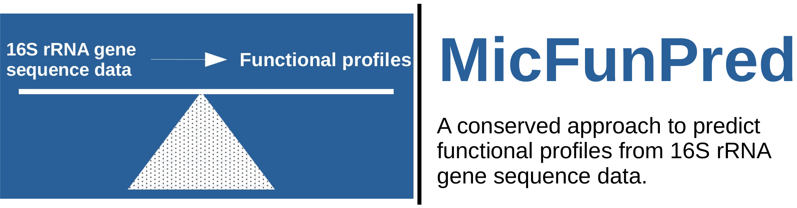

[

](http://210.212.161.138/MicFunPred/)

#### This repository contains data used in comparative analysis of MicFunPred and other tools for the prediction of imputed metagenomes. MicFunPred code is freely available at https://github.com/microDM/MicFunPred and http://210.212.161.138/MicFunPred/ as online webserver.

This repository contains mainly 3 directories:

1. 0_parameter_optimization: Performance of MicFunPred at different % identity and gene coverage cut-off in terms of Spearman's correlations (correlation.csv), accuracy based on presence/absence of genes (accuracy.csv) and accuracy of prediction of differentially abundant genes (deseq2).

2. 1_simulated_data: Simulated dataset(OTU table, 16S rRNA sequences and metagenome) with predictions by different tools, Spearman's correlation (correlation.csv) and accuracy in terms of presence/absence of genes (accuracy.csv)

3. 2_real_datasets: Real dataset(OTU table, 16S rRNA sequences and metagenome) with predictions by different tools, Spearman's correlation (correlation.csv), accuracy in terms of presence/absence of genes (accuracy.csv) and accuracy of prediction of differentially abundant genes (accuracy_deseq2.csv)